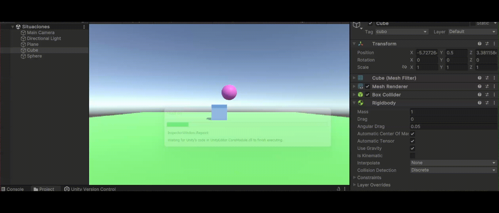
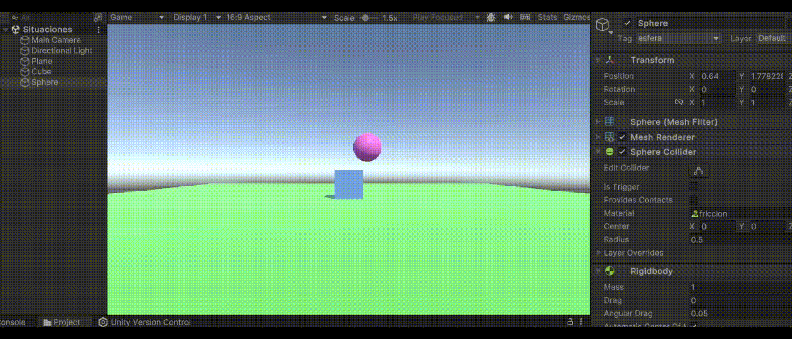
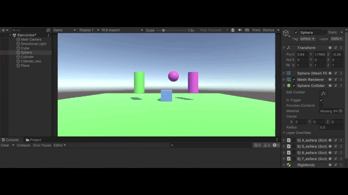

# Práctica 3 - Movimiento y Físicas

## Experimentando con la Física desde el Editor

Se han creado un plano, una esfera y un cubo en las posiciones especificadas, siguiendo las instrucciones iniciales. Cada objeto se ha personalizado para facilitar su identificación, aplicando colores (mediante materiales) y etiquetas.

### Situación 1
Se le asigna un componente `Rigidbody` al cubo, mientras que la esfera y el plano mantienen solo sus colliders por defecto. Al ejecutar, no ocurre nada significativo, ya que el cubo, aunque tiene un `Rigidbody` y debería caer, colisiona con el plano y se mantiene en su posición.

### Situación 2
Tanto la esfera como el cubo tienen ahora `Rigidbody`, mientras que el plano sigue solo con su collider. Al ejecutar, el cubo se comporta igual que antes, pero la esfera, al estar más elevada, cae debido a la gravedad. Primero colisiona con el cubo (ambos tienen colliders), luego continúa rodando por el plano hasta que llega al borde, donde finalmente cae al vacío.

### Situación 3
La diferencia aquí es que la esfera se ha configurado como cinemática al marcar la opción "Is Kinematic" en su `Rigidbody`, lo que impide que sea afectada por las físicas. En la ejecución, la esfera se mantiene estática, similar a la situación 1, pero en este caso es porque, al ser cinemática, no es movida por el motor de físicas.

### Situación 4
Los tres objetos tienen ahora `Rigidbody`, por lo que al iniciar la simulación, todos caen bajo la influencia de la gravedad.

### Situación 5
Igual que antes, los tres objetos tienen `Rigidbody`, pero se le asigna a la esfera una masa de 10. Sin embargo, no se observa una diferencia notable en la ejecución respecto a la situación anterior. Esto puede deberse a la ausencia de fuerzas adicionales actuando sobre la esfera, ya que, además de la gravedad, la resistencia también influye en el comportamiento de los objetos.

### Situación 6
Similar a la situación anterior, pero con la masa de la esfera aumentada a 100. Nuevamente, no se percibe una diferencia clara en la simulación, repitiendo el mismo resultado que en los casos anteriores.

### Situación 7
En este escenario, los objetos tienen `Rigidbody` con masa de 1, pero se añade fricción a la esfera mediante un `Physic Material`. Se han ajustado los parámetros de "Dynamic Friction" y "Static Friction" a 1, para que tenga alta fricción en movimiento o en reposo. En la simulación se observa el material físico en el apartado `Sphere Collider >> Material`, pero no se aprecia un cambio notable en la ejecución respecto a las situaciones anteriores.

### Situación 8
La esfera deja de ser un objeto físico y se convierte en un trigger. Se ha configurado su Rigidbody como cinemático y su collider como un trigger. Como resultado, el cubo y el plano caen al vacío, mientras que la esfera permanece flotando en el aire.

### Situación 9
La diferencia respecto a la situación anterior es que ahora la esfera vuelve a ser un objeto físico, ya no es cinemática, pero sigue siendo un trigger. En la ejecución, los tres objetos caen al vacío. Aunque la esfera es un trigger, su comportamiento no varía en la simulación, lo cual sería interesante explicar mejor, ya que visualmente no se percibe ninguna diferencia.

---

## Movimiento - Físicas

### Ejercicio 1
Para este caso, se crea un cubo con su etiqueta y material. Se crea el script `ej1`, que se asigna como componente al cubo, en el que se le crea un valor para la velocidad que puede ser modificado desde el inspector. Luego, para obtener el valor de la horizontal y la vertical, se usa `Input.GetAxis` y para mostrar el mensaje en pantalla se comprueba qué tecla se presionó con `Input.GetKeyDown`.

### Ejercicio 2
Para este ejercicio, hay que ir a `Edit >> Project Settings… >> Input Manager`. Una vez en la ventana, se aumenta el tamaño del *size* (para crear un nuevo eje) y se crea uno similar al anterior. Como se ve en la imagen, solo se ha modificado el nombre a 'Disparar' y el 'Positive button' se le asigna la tecla 'h'.

### Ejercicio 3
En este ejercicio, se crea un vector y una velocidad modificables en el inspector (la segunda con velocidad 10 por defecto). Tal como se indica, inicialmente la posición 'y' del cubo vale 0. Se emplea la función `Translate` para hacer el movimiento. Al no indicar un sistema de coordenadas en `Translate`, las operaciones se realizan en función de las coordenadas locales (las del cubo).

- **Experimentos**:
  1. **Apartado a**: Se duplica el vector dirección. Esto se aprecia en el inspector y en la animación, aunque no es fácil de notar por la posición de la cámara y el movimiento.
  

  2. **Apartado b**: Se duplica la velocidad. Es notable en el inspector y el cubo se mueve más rápido.
  

  3. **Apartado c**: Se utiliza una velocidad menor a 1 (por ejemplo, -3). En este caso, el cubo se mueve hacia atrás.
  

  4. **Apartado d**: Se modifica la altura del cubo a *y > 0*. El movimiento sigue la misma dirección porque se mueve hacia una dirección, no hacia un punto específico.
  

  5. **Apartado e**: Se cambia el sistema de referencia de local a mundial (*Space.World*). No hay diferencias visibles ya que el cubo y el sistema mundial están alineados.
  

### Ejercicio 4
En este ejercicio se crean dos scripts (`ej4_cubo` y `ej4_esfera`). Para el cubo, se usan las teclas de las flechas y para la esfera las letras indicadas (WASD). La velocidad es modificable desde el inspector y, según la tecla presionada, se obtiene la dirección (*forward, back, left o right*). Luego se usa `Translate` para mover el objeto.

### Ejercicio 5
Es lo mismo que en el ejercicio anterior, pero en este caso se añade la multiplicación por `Time.deltaTime` al `Translate`. Esto suaviza el movimiento del objeto, haciendo que se mueva de manera más fluida en lugar de a saltos.

### Ejercicio 6
Adapta el movimiento del ejercicio 5 para que el cubo se mueva hacia la posición de la esfera. Se utiliza el vector que une ambos objetos como dirección de movimiento. Este vector se normaliza para que la velocidad no dependa de la distancia entre los dos objetos.

### Ejercicio 7
En este ejercicio se copia exactamente lo del ejercicio 6, con la diferencia de que en el script de la esfera (`ej7_esfera`) se debe usar `LookAt` para que el cubo mire hacia la esfera antes de desplazarse para seguirla. Además, ha sido necesario en los dos métodos `Translate` indicar que el sistema de referencias sea el mundo (*Space.World*), para que el movimiento del cubo siga siendo coherente a pesar de seguir a la esfera. De lo contrario, llega un punto en el que se pierde la correspondencia entre las teclas y los movimientos, al menos para el usuario.

### Ejercicio 8
En este caso, solo se ha creado un script para el cubo. El movimiento en horizontal (flechas izquierda y derecha) se utiliza para rotar el cubo en la dirección indicada, y con `Translate` se asegura que el cubo siempre avance en la dirección hacia adelante, siguiendo su orientación.

### Ejercicio 9
En este ejercicio, se añade un nuevo objeto cilindro que actúa como un `Rigidbody`. En el nuevo script `ej9`, se crea el método `OnCollisionEnter` para registrar en la consola un mensaje con la etiqueta del objeto que colisiona con el cilindro. Cabe destacar que para mover la esfera y el cubo se utilizan los scripts del ejercicio 5, y el cilindro se ha dejado congelado en su posición para facilitar la interacción.

### Ejercicio 10
Este ejercicio no requirió modificaciones en el script anterior. Se creó un nuevo script para la esfera, que también tiene un `Rigidbody`, permitiendo su movimiento. Se identifican las teclas de control y se aplica `AddForce` para desplazar la esfera. La animación muestra cómo la esfera se mueve horizontal y verticalmente, mientras que sin interacción con las teclas, el motor de físicas se encarga de su movimiento. El cilindro sigue utilizando el script del Ejercicio 9, mientras que a la esfera se le asigna el script `ej10_esfera`.

### Ejercicio 11
En este caso, el script `ej11` asignado al cilindro utiliza `OnTriggerEnter` para detectar colisiones. El comportamiento es similar al de los ejercicios anteriores, pero ahora se registra un mensaje cuando algo colisiona con el cilindro.

### Ejercicio 12
Este ejercicio introduce un cilindro con un `Rigidbody`, controlado por teclas. He asignado las teclas *I* y *K* para el movimiento vertical, y *J* y *L* para el horizontal. Además, se utiliza la tecla *U* para moverlo hacia la esfera, calculando la dirección de desplazamiento y ajustando su rotación con *MoveRotation*. Se añaden diversos experimentos para observar diferentes comportamientos:

- **Experimentos**:
  1. **Masa 10**: La esfera se desliza más lentamente, mostrando efectos de masa.
     
  
  2. **Masa 0.1**: La esfera se mueve rápidamente, casi disparada.
     

  3. **Cinemática**: La esfera flota, ya que no responde al motor de físicas.
     

  4. **Trigger**: La esfera atraviesa el plano al ser un trigger.
     

  5. **Fricción**: Al aumentar la fricción del cilindro de 0.5 a 1, se nota que cuesta más moverlo, aunque la diferencia es sutil.
     | **Fricción 0.5** | **Fricción 1** |
     |:----------------:|:--------------:|
     |||
