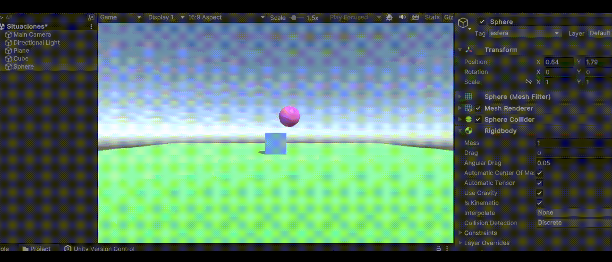
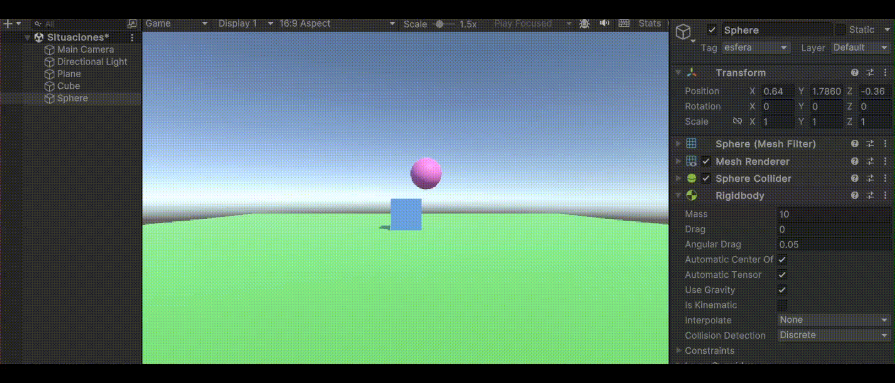

# Práctica 3 - Movimiento y físicas
### Experimentando con la física desde el editor
Se han creado un plano, una esfera y un cubo en las posiciones especificadas, siguiendo las instrucciones iniciales. Cada objeto se ha personalizado para facilitar su identificación, aplicando colores (mediante materiales) y etiquetas.
- **Situación 1**: Se le asigna un componente Rigidbody al cubo, mientras que la esfera y el plano mantienen solo sus colliders por defecto. Al ejecutar, no ocurre nada significativo, ya que el cubo, aunque tiene un Rigidbody y debería caer, colisiona con el plano y se mantiene en su posición.

  
  
- **Situación 2**: Tanto la esfera como el cubo tienen ahora Rigidbody, mientras que el plano sigue solo con su collider. Al ejecutar, el cubo se comporta igual que antes, pero la esfera, al estar más elevada, cae debido a la gravedad. Primero colisiona con el cubo (ambos tienen colliders), luego continúa rodando por el plano hasta que llega al borde, donde finalmente cae al vacío.
  
    
  
- **Situación 3**: La diferencia aquí es que la esfera se ha configurado como cinemática al marcar la opción "Is Kinematic" en su Rigidbody, lo que impide que sea afectada por las físicas. En la ejecución, la esfera se mantiene estática, similar a la situación 1, pero en este caso es porque, al ser cinemática, no es movida por el motor de físicas.
  
    
  
- **Situación 4**: Los tres objetos tienen ahora Rigidbody, por lo que al iniciar la simulación, todos caen bajo la influencia de la gravedad.
  
    
  
- **Situación 5**: Igual que antes, los tres objetos tienen Rigidbody, pero se le asigna a la esfera una masa de 10. Sin embargo, no se observa una diferencia notable en la ejecución respecto a la situación anterior. Esto puede deberse a la ausencia de fuerzas adicionales actuando sobre la esfera, ya que, además de la gravedad, la resistencia también influye en el comportamiento de los objetos.
  
    
  
- **Situación 6**: Similar a la situación anterior, pero con la masa de la esfera aumentada a 100. Nuevamente, no se percibe una diferencia clara en la simulación, repitiendo el mismo resultado que en los casos anteriores.
  
    
  
- **Situación 7**: En este escenario, los objetos tienen Rigidbody con masa de 1, pero se añade fricción a la esfera mediante un "Physic Material". Se han ajustado los parámetros de "Dynamic Friction" y "Static Friction" a 1, para que tenga alta fricción en movimiento o en reposo. En la simulación se observa el material físico en el apartado Sphere Collider >> Material, pero no se aprecia un cambio notable en la ejecución respecto a las situaciones anteriores.
  
    
  
- **Situación 8**: La esfera deja de ser un objeto físico y se convierte en un trigger. Se ha configurado su Rigidbody como cinemático y su collider como un trigger. Como resultado, el cubo y el plano caen al vacío, mientras que la esfera permanece flotando en el aire.
  
    
  
- **Situación 9**: La diferencia respecto a la situación anterior es que ahora la esfera vuelve a ser un objeto físico, ya no es cinemática, pero sigue siendo un trigger. En la ejecución, los tres objetos caen al vacío. Aunque la esfera es un trigger, su comportamiento no varía en la simulación, lo cual sería interesante explicar mejor, ya que visualmente no se percibe ninguna diferencia.
  
    
  
### Movimiento - Físicas
- **Ejercicio 1**:
- **Ejercicio 2**:
- **Ejercicio 3**:
- **Ejercicio 4**:
- **Ejercicio 5**:
- **Ejercicio 6**:
- **Ejercicio 7**:
- **Ejercicio 8**:
- **Ejercicio 9**:
- **Ejercicio 10**:
- **Ejercicio 11**:
- **Ejercicio 12**:
