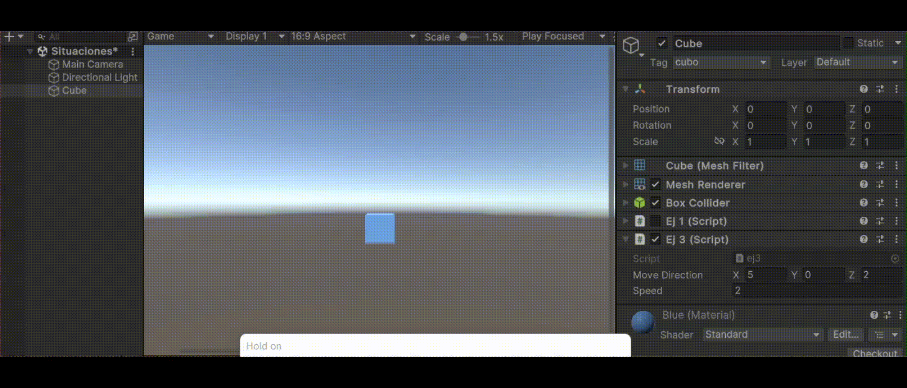

# Práctica 3 - Movimiento y Físicas

## Experimentando con la Física desde el Editor

Se han creado un plano, una esfera y un cubo en las posiciones especificadas, siguiendo las instrucciones iniciales. Cada objeto se ha personalizado para facilitar su identificación, aplicando colores (mediante materiales) y etiquetas.

### Situación 1
Se le asigna un componente `Rigidbody` al cubo, mientras que la esfera y el plano mantienen solo sus colliders por defecto. Al ejecutar, no ocurre nada significativo, ya que el cubo, aunque tiene un `Rigidbody` y debería caer, colisiona con el plano y se mantiene en su posición.

### Situación 2
Tanto la esfera como el cubo tienen ahora `Rigidbody`, mientras que el plano sigue solo con su collider. Al ejecutar, el cubo se comporta igual que antes, pero la esfera, al estar más elevada, cae debido a la gravedad. Primero colisiona con el cubo, luego continúa rodando por el plano hasta que llega al borde, donde finalmente cae al vacío.

### Situación 3
La esfera se ha configurado como cinemática al marcar la opción "Is Kinematic" en su `Rigidbody`, lo que impide que sea afectada por las físicas. En la ejecución, la esfera se mantiene estática, similar a la situación 1.

### Situación 4
Los tres objetos tienen ahora `Rigidbody`, por lo que al iniciar la simulación, todos caen bajo la influencia de la gravedad.

### Situación 5
Los tres objetos tienen `Rigidbody`, pero se le asigna a la esfera una masa de 10. No se observa una diferencia notable en la ejecución respecto a la situación anterior.

### Situación 6
La masa de la esfera se aumenta a 100. Nuevamente, no se percibe una diferencia clara en la simulación.

### Situación 7
Los objetos tienen `Rigidbody` con masa de 1, y se añade fricción a la esfera mediante un "Physic Material". Sin embargo, no se aprecia un cambio notable en la ejecución.

### Situación 8
La esfera se convierte en un trigger. Como resultado, el cubo y el plano caen al vacío, mientras que la esfera permanece flotando en el aire.

### Situación 9
La esfera vuelve a ser un objeto físico, pero sigue siendo un trigger. Los tres objetos caen al vacío.

---

## Movimiento - Físicas

### Ejercicio 1
Para este caso, se crea un cubo con su etiqueta y material. Se crea el script `ej1`, que se asigna como componente al cubo, en el que se le crea un valor para la velocidad que puede ser modificado desde el inspector. Se utiliza `Input.GetAxis` para obtener los valores de horizontal y vertical, y `Input.GetKeyDown` para mostrar el mensaje en pantalla.

### Ejercicio 2
Para este ejercicio, se accede a `Edit >> Project Settings… >> Input Manager`. Se aumenta el tamaño del *size* y se crea un nuevo eje similar al anterior, cambiando el nombre a "Disparar" y asignando la tecla 'h' como 'Positive button'.

### Ejercicio 3
En este ejercicio, se crea un vector y una velocidad modificables en el inspector (la segunda con velocidad 10 por defecto). La posición 'y' del cubo vale 0 inicialmente. Se emplea `Translate` para hacer el movimiento.

- **Experimentos**:
  1. **Apartado a**: Se duplica el vector dirección. Esto se aprecia en el inspector y en la animación.
  

  2. **Apartado b**: Se duplica la velocidad.
  

  3. **Apartado c**: Se utiliza una velocidad menor a 1 (por ejemplo, -3).
  

  4. **Apartado d**: Se modifica la altura del cubo a *y > 0*.
  

  5. **Apartado e**: Se cambia el sistema de referencia de local a mundial (*Space.World*).
  

### Ejercicio 4
Se crean dos scripts (`ej4_cubo` y `ej4_esfera`). El cubo se controla con las teclas de flecha y la esfera con WASD. Se utiliza `Translate` para mover el objeto.

### Ejercicio 5
Se añade la multiplicación por `Time.deltaTime` al `Translate`, suavizando el movimiento del objeto.

### Ejercicio 6
El movimiento se adapta para que el cubo se mueva hacia la posición de la esfera. Se utiliza el vector que une ambos objetos como dirección de movimiento.

### Ejercicio 7
Se copia exactamente lo del ejercicio 6, pero en el script de la esfera se debe usar `LookAt` para que el cubo mire hacia la esfera antes de desplazarse.

### Ejercicio 8
Se crea un script para el cubo que rota en la dirección indicada con las flechas y siempre avanza hacia adelante.

### Ejercicio 9
Se añade un cilindro que actúa como un `Rigidbody`. Se utiliza `OnCollisionEnter` para registrar un mensaje en la consola con la etiqueta del objeto que colisiona con el cilindro.

### Ejercicio 10
Se crea un nuevo script para la esfera, que también tiene un `Rigidbody`, permitiendo su movimiento. Se aplica `AddForce` para desplazar la esfera.

### Ejercicio 11
El script `ej11` asignado al cilindro utiliza `OnTriggerEnter` para detectar colisiones y registra un mensaje cuando algo colisiona con el cilindro.

### Ejercicio 12
Se introduce un cilindro con un `Rigidbody`, controlado por teclas. Se asignan las teclas *I* y *K* para movimiento vertical, y *J* y *L* para horizontal. Se utiliza la tecla *U* para moverlo hacia la esfera.

- **Experimentos**:
  1. **Masa 10**: La esfera se desliza más lentamente, mostrando efectos de masa.
     
  
  2. **Masa 0.1**: La esfera se mueve rápidamente, casi disparada.
     

  3. **Cinemática**: La esfera flota, ya que no responde al motor de físicas.
     

  4. **Trigger**: La esfera atraviesa el plano al ser un trigger.
     

  5. **Fricción**: Al aumentar la fricción del cilindro de 0.5 a 1, se nota que cuesta más moverlo.
     | **Fricción 0.5** | **Fricción 1** |
     |:----------------:|:--------------:|
     |||
